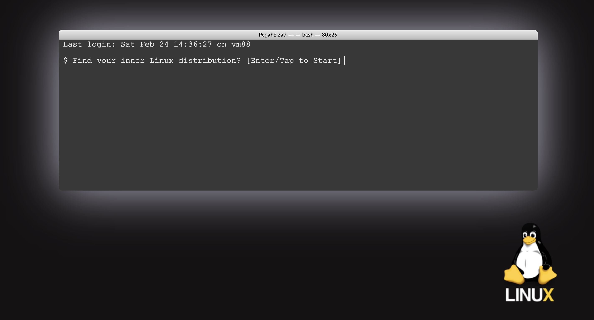
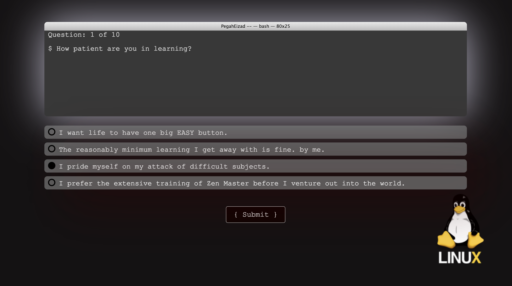
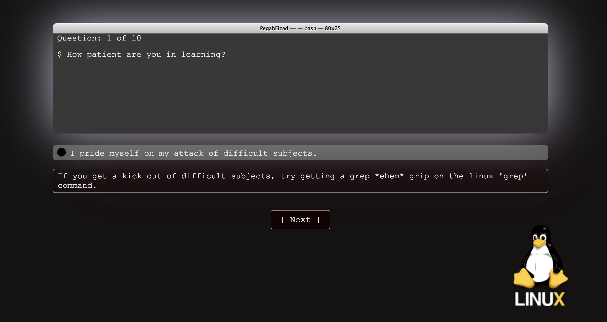
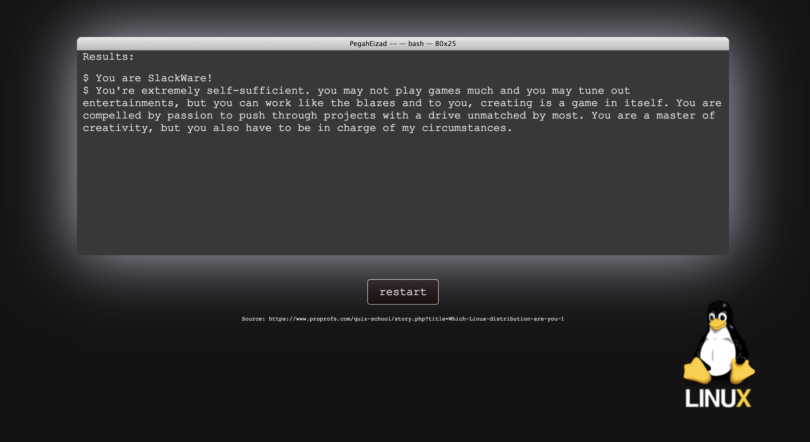

# Find-Your-Inner-Linux-Distro

INTRODUCTION:
-
'Find Your Inner Linux Distro' is a quiz app built with HTML5, CSS3, JavaScript, JQuery and CSS Grid (responsive design). 
The quiz is a light-hearted personality test which matches you with a Linux distribution. 
The technical idea behind the quiz is to demonstrate event handling, and DOM manipulation and traversal in a dynamic and responsive front-end application. Furthermore, the quiz demonstrates HTML form handling by processing the answer choices in a an HTML form element. 
The design choices for this quiz application were made to simulate the look and feel of a Linux shell environment.
The answer choics 

USER-SUMMARY:
-
- The user is given a question prompt to start the quiz by hitting the Enter key (similar to how most shell programs prompt the user), or by tapping the screen/clicking. This option was designed for the convenience of mobile users. 
- If the user chooses to not take the quiz, they can simply stop the program by pressing any other key. 
- Once the quiz is sarted, the questions appear inside the console on the page, and the answer choices appear underneath the console. 
- The user must pick an answer choice and submit in order to move on to the next question. 
- Once the user submits their answer choice, an answer-feedback appears underneath the answer they picked, along with a 'Next' button that takes presents them with the next question. 
- The quiz presents the user with their 'Linux distribution' result when all 10 questions have been answered. 
- On the results page, the user has the option to retake the quiz by hittin the 'restart' button. 

ATTRIBUTION:
-
A significant portion of the questions are from the following:
https://www.proprofs.com/quiz-school/story.php?title=Which-Linux-distribution-are-you-1

